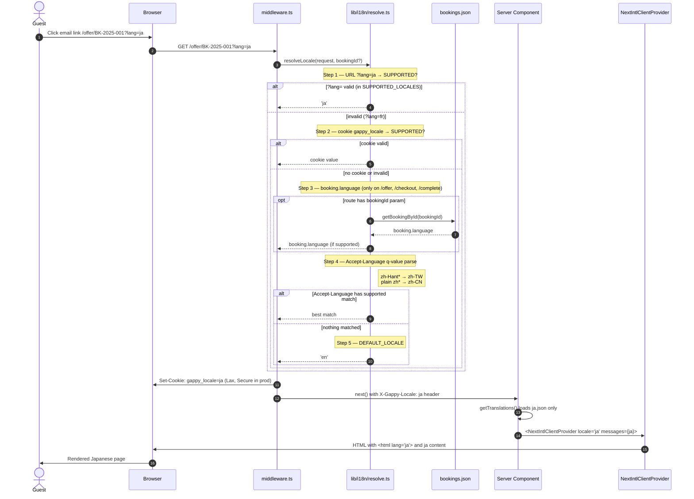

# ADR 0001 — Internationalization Architecture

- **Status**: Proposed, 2026-05-17 — awaiting Phase 2 review
- **Ticket**: T-15 "Multi-Language i18n" (foundation; T-1, T-3, T-4, T-6 depend
  on it)
- **Branch**: `feature/multi-language-i18n`
- **Companion**: [`docs/i18n-audit.md`](../i18n-audit.md) (Phase 1 audit)

This ADR records every load-bearing decision for T-15. Phase 3+ implementation
follows directly from §3 ("Decisions") below; deviations require a new ADR.

---

## 1. Context

Gappy Stay is an AI-native pre-arrival guest experience SaaS for luxury
Japanese ryokan and boutique hotels. The product's ICP is luxury Japanese
lodging whose guests are inbound international travelers; the existing
Western-built incumbent (Canary Technologies) is weak in East Asian languages,
and Gappy's market differentiation is partly "rebuilt for the markets Canary
can't reach." Mandatory locales — `en`, `ja`, `zh-TW`, `zh-CN`, `ko` — are
unusual for hospitality SaaS, where most products only ship `en/de/fr`.

Today the repo already contains a small custom i18n layer:

- `lib/i18n.ts` — a flat typed `Strings` table for 4 locales (`en | ja | ko |
  zh`).
- `context/LangContext.tsx` — a client-only React provider.
- `Booking.language: 'en' | 'ja' | 'ko' | 'zh'` — locale persisted per guest at
  CSV upload time via `detectLang(nationality)`.

The system has no request-level resolution chain (URL / cookie /
Accept-Language), no language switcher, no `<html lang>` reflection, and no
observability for missing keys. Bundle splitting is also absent (all locales
ship in every page). The Phase 1 audit catalogues ≈50 user-facing keys to
migrate and ≈12 net-new keys on the unintegrated landing page.

This ADR formalizes the rebuild.

---

## 2. Scope and forward-compatibility constraints

In scope (this ticket):

- 5 locales: `en`, `ja`, `zh-TW`, `zh-CN`, `ko`. Each has its own JSON file in
  `lib/i18n/locales/`.
- Locale resolution chain on every request (URL → cookie → `booking.language`
  when in booking context → Accept-Language → `en`).
- Type-safe translation access on server *and* client components.
- ICU MessageFormat for plurals; `Intl`-backed helpers (via `next-intl`) for
  dates/numbers.
- Language switcher component (consumer-positioned).
- `<html lang>` reflects the active locale.
- Missing-key dev warnings and prod structured logs.
- CI parity script.
- AI bootstrap pipeline for the non-English locales.

Explicitly **out of scope** (deferred, with TODO references):

- Admin UI translation (`app/admin/*`) — brief §8.
- RTL languages.
- Locale-aware images.
- Translation management UI (Crowdin etc.).
- AI-generated content translation parity (`offer.title`/`description`/`badge`/
  `personalized_message` from `generate-offers/route.ts`, and
  `offer.includes` slug rendering). Tracked under follow-up **T-15b** —
  TODO comments at the call sites will reference that ticket.
- Hreflang `<link>` tags; gender-aware translations; currency conversion.

---

## 3. Decisions

### DD-1 — URL strategy: **Query parameter** (`?lang=<code>`)

- **Chosen**: query parameter on the guest-facing routes
  (`/offer/[bookingId]?lang=ja`, `/checkout?lang=ja`, etc.).
- **Rejected (a) path-based** (`/ja/offer/[bookingId]`): would force
  restructuring every guest route to `app/[locale]/...`. Guest URLs are
  tokenized per booking and not SEO-relevant, so the SEO upside of path-based
  is zero. The structural cost is high (every existing route file moves, every
  internal `router.push` changes).
- **Rejected (b) cookie-only**: shareable links cannot pre-select locale,
  breaking the "guest opens email link in correct language on first click"
  promise. Marketing campaigns can't target a locale via URL.
- **Forward-compat boundary**: when future marketing pages need SEO-friendly
  locale routing, they can adopt path-based under a separate route group, e.g.
  `app/(marketing)/[locale]/...`, *without affecting the guest path*. The
  `next-intl` middleware supports both strategies simultaneously when scoped by
  matcher.

The query param wins for one more reason: the resolution chain (DD-3 of the
brief / FR-1) needs to be observable on every request without route
restructuring. A `?lang=` param is the simplest fork point.

### DD-2 — Library: **`next-intl`** (with `react-intl` fallback only if Next 16 incompatible)

- **Chosen**: `next-intl`, latest version verified-against-Next-16 at install
  time. Best App Router story (Server Components support, RSC-aware
  `getTranslations()`, typed messages via `Messages` interface, ICU
  MessageFormat built-in, formatters for date/number, middleware helper).
- **Verification gate (Phase 3, first action)**: `npm install next-intl` then
  `npm ls next-intl` and inspect `node_modules/next-intl/package.json` for
  `peerDependencies.next` compatibility with `16.2.3`. The published changelog
  and `peerDependencies` are the authoritative check — if either declares
  `next@<16`, halt and escalate per brief §13.
- **Rejected (a) `react-intl` (FormatJS)**: works fine, but its App Router
  story for RSC requires extra glue (the FormatJS team's own guidance is to
  prefer App-Router-native solutions). Boilerplate cost is higher.
- **Rejected (b) Lingui**: compile-time extraction shrinks the runtime but
  requires a Babel/SWC plugin that adds CI complexity. With only ≈50 keys, the
  runtime saving is not worth it.
- **Rejected (c) Custom**: we already have a custom solution that's missing
  half the requirements; rebuilding to match `next-intl` features means
  reimplementing ICU MessageFormat and route detection. No.

### DD-3 — Translation key naming: **nested, `camelCase`, scoped by feature**

- **Form**: nested JSON objects keyed by feature → sub-area → leaf. Leaf keys
  are camelCase.
- **Casing**: camelCase segments (matches existing `lib/i18n.ts`, matches
  TypeScript identifier convention so generated types are ergonomic).
- **Namespacing**: by **feature/page**, not by **component file**, so a string
  shared between `OfferCard` and `BundleCard` lives once under `offerCard.*` or
  `common.*`, not duplicated. Bundle-card-specific labels live under
  `bundleCard.*`.
- **Top-level namespaces** (drawn from the audit):
  - `common.*` — buttons, labels reused everywhere (`cancel`, `confirm`,
    `loading`, `back`, `backToHotel`, `total`).
  - `landing.*` — `/` page (lookup, hero, errors).
  - `offer.*` — `/offer/[bookingId]` page chrome (welcome banner, category
    section headers, intro, empty state).
  - `offerCard.*` — `OfferCard` component (`addBtn`, `addedBtn`, `onlyLeft`,
    `units.*`).
  - `bundleCard.*` — `BundleCard` (`bundleLabel`, `savingsOff`,
    `addBundleBtn`).
  - `cart.*` — `CartDrawer` and `/checkout`.
  - `complete.*` — `/complete` page.
  - `email.*` — `send-offer-email/route.ts` (`greeting`, `intro`, `cta`,
    `offerLabel`, `subject`, `footerLine1`, `footerLine2`, `pageTitle`).
  - `channel.*` — messaging channel labels (`LINE`, `WhatsApp`, `SMS`,
    `Email`).
  - `units.*` — pricing unit labels (`perStay`, `perNight`, etc.).
- **Brand wordmark policy (audit §10 Q2)**: the strings `"Gappy Stay"`, `"▶
  Gappy Stay"`, and `"Gappy Hotel Tokyo"` are **proper nouns**. They stay
  untranslated in all 5 locales and are intentionally **not** added to the
  JSON. JSX uses literals as today. A short note in the README contribution
  guide will spell this out so future contributors don't relitigate.

### DD-4 — Bootstrap workflow for non-English translations

- **Mechanism**: a one-off script `scripts/i18n-generate.ts` invoked manually
  (`npm run i18n:generate`). Uses `@anthropic-ai/sdk` (already in deps). Reads
  the full `en.json` source, sends a single batched prompt per target locale
  with strict instructions (preserve ICU placeholders, do not localize brand
  wordmarks, output JSON that exactly mirrors the input structure), writes the
  result to `<locale>.json`. Commits results.
- **Not at build time**: build-time generation makes builds nondeterministic
  and burns API spend on every CI run. Commit the outputs.
- **Review tracking (audit §10 Q1, brief Appendix B)**: a sibling
  `lib/i18n/locales/_meta.json` file maps every key to a status enum: `"ai" |
  "human"`. The bootstrap script writes `"ai"` for everything it generates;
  human reviewers flip entries to `"human"` as they validate. The
  `npm run i18n:check` script reports total `"ai"` vs `"human"` per locale so
  pre-launch review readiness is visible at a glance.
  - Rejected alternative: a `__needs_review__` sibling field inside each JSON
    object. This pollutes the message tree and breaks `next-intl`'s strict
    schema expectations.
- **For new keys (post-bootstrap)**: contributor adds the English string,
  then runs `npm run i18n:generate --key=<dotted.path>` to re-bootstrap just
  that key in the four non-English files. The CONTRIBUTING note documents this.
- **The `zh-TW` policy** (audit §10 Q1, confirmed): the existing `'zh'`
  values in `Booking.language` and offer content are **aliased to `'zh-CN'`**
  at the request layer; `zh-TW` content is AI-bootstrapped with native review
  deferred post-PoC. The audit log entry for this decision in
  `lib/i18n/locales/_meta.json` keeps the trail visible.

### DD-5 — Pluralization, dates, numbers

- **Plurals**: ICU MessageFormat. Existing keys `onlyLeft(n)` and
  `cartItems(n)` re-expressed as
  `"{count, plural, one {Only # left} other {Only # left}}"` (English is
  trivially plural-stable but other locales need `=0`/`one`/`other` arms; the
  bootstrap prompt instructs Claude to produce locale-correct CLDR plural
  categories).
- **Dates**: replace ad-hoc `Date.toLocaleDateString(t.dateLocale, ...)` with
  `next-intl`'s `useFormatter()` (`fmt.dateTime(date, { month: 'short', day:
  'numeric' })`). Removes the `dateLocale` member from the existing `Strings`
  table.
- **Numbers / currency display**: `next-intl` formatters for guests-facing
  numbers. The yen sign (`¥`) is kept as a static prefix per brief §8 (no FX);
  do not switch to `Intl.NumberFormat.currency('JPY')` which would emit `¥` or
  `JP¥` inconsistently across locales.
- **`Booking.language` retained**: kept as a per-guest content preference;
  used in the resolution chain (DD-6) and as the default `locale` parameter
  for `getEmailTranslations()` (FR-6).

### DD-6 — Server + client translation access, and locale propagation

- **Server components** (RSC, default in App Router): import
  `getTranslations` from `next-intl/server`:
  ```ts
  import { getTranslations } from 'next-intl/server'
  const t = await getTranslations('offer')
  ```
- **Client components** (`'use client'`): use the hook:
  ```ts
  'use client'
  import { useTranslations } from 'next-intl'
  const t = useTranslations('offerCard')
  ```
- **Locale propagation**: a `<NextIntlClientProvider locale={locale}
  messages={messages}>` lives in `app/layout.tsx`. Its `messages` prop is the
  **active locale only** (NFR-1 — no cross-locale bundle bloat). The root
  layout resolves the active locale via `getRequestConfig` in
  `lib/i18n/request.ts` (called by next-intl middleware on every request).
- **Resolution chain** (FR-1, with audit §10 Q3 confirmation):

  | Order | Source | Applies on |
  |---|---|---|
  | 1 | URL `?lang=<code>` | all routes |
  | 2 | Cookie `gappy_locale` | all routes |
  | 3 | `booking.language` | routes with a booking context only — `/offer/[bookingId]`, `/checkout`, `/complete` |
  | 4 | `Accept-Language` header (q-value parsed; `zh-Hant*` → `zh-TW`, plain `zh*` → `zh-CN`) | all routes |
  | 5 | `'en'` default | all routes |

  > **Deviation from brief FR-1 — flag for reviewer.** The brief's FR-1 puts
  > Accept-Language at step 3 and has no `booking.language` step. The user
  > approved an explicit chain (URL → cookie → `booking.language` →
  > Accept-Language → en) for **booking-context routes**. On non-booking
  > routes (e.g. `/`), step 3 is skipped and Accept-Language falls at the
  > original FR-1 position. Two equivalent ways to describe the user's note —
  > the explicit chain wins because it's the more specific specification.
  >
  > If the intended ordering was instead URL → cookie → Accept-Language →
  > `booking.language` → en (matching the audit's original proposal), this is
  > the place to correct it before Phase 3.

- **Cookie**: name `gappy_locale` per NFR-4 (namespaced, avoids `NEXT_LOCALE`
  collisions). Attributes: `Path=/`, `SameSite=Lax`, `Max-Age=31536000`,
  `Secure` in production, **no** `HttpOnly` (the switcher reads it). The
  switcher writes it via `document.cookie`; the middleware also writes it
  whenever a valid `?lang=` is observed, so the cookie auto-pins on
  first-with-param visit.
- **Middleware**: at `middleware.ts` (repo root). Uses
  `createMiddleware({ localePrefix: 'never', ... })` from `next-intl` because
  we are query-param-based (DD-1). Custom logic merges our chain into
  `next-intl`'s expected shape via a `getRequestConfig` hook so the library's
  `routing` config sees a single resolved locale.

### DD-7 — `LanguageSwitcher` placement

- **Pattern**: a self-contained, consumer-positioned component
  (`components/LanguageSwitcher.tsx`). It is **not** auto-injected into the
  root layout. Pages place it where their layout calls for.
- **Phase 3 minimum**: integrated only in `app/page.tsx` (top-right of the
  landing page, as FR-2 specifies). T-1 will revisit landing styling.
- **Why not in root layout**: the `/offer/[bookingId]` page already has its
  own top nav (`OfferPageClient.tsx`); injecting a fixed top-right switcher
  into the root would either overlap or require extra CSS escapes. The
  switcher needs explicit placement per surface — that's a one-line ergonomic
  cost in exchange for clean composition.
- **Re-render scope**: not a tradeoff under `next-intl` query-param strategy.
  The switcher writes the cookie and `router.replace('?lang=<code>')`. The
  navigation re-runs `getRequestConfig`; the entire tree re-renders with the
  new messages chunk. No deep context-provider gymnastics required.
- **Accessibility (NFR-3)**: `<button>` opens a `<ul role="listbox">`,
  arrow-key navigation, `aria-current="true"` on the active locale, native
  language names (`English / 日本語 / 繁體中文 / 简体中文 / 한국어`). On
  selection, an `aria-live="polite"` region announces "Language changed to
  Japanese" (in the *new* locale).

---

## 4. Proposed directory layout

```
.
├── docs/
│   ├── adr/
│   │   └── 0001-i18n-architecture.md      ← this file
│   └── i18n-audit.md                       ← Phase 1
├── middleware.ts                           ← new — locale resolution + cookie pin
├── lib/
│   └── i18n/
│       ├── config.ts                       ← SUPPORTED_LOCALES, DEFAULT_LOCALE, types
│       ├── request.ts                      ← next-intl getRequestConfig
│       ├── email.ts                        ← getEmailTranslations(locale) for FR-6
│       ├── resolve.ts                      ← resolveLocale(request, booking?) — pure fn, unit-tested
│       └── locales/
│           ├── en.json                     ← source of truth
│           ├── ja.json                     ← AI-bootstrapped (Phase 4)
│           ├── zh-TW.json                  ← AI-bootstrapped
│           ├── zh-CN.json                  ← AI-bootstrapped (existing zh content seeds this)
│           ├── ko.json                     ← AI-bootstrapped
│           └── _meta.json                  ← per-key {"ai" | "human"} status
├── lib/
│   └── i18n.ts                              ← REMOVED in Phase 4 (replaced by lib/i18n/*)
├── context/
│   └── LangContext.tsx                      ← REMOVED in Phase 4 (replaced by NextIntlClientProvider)
├── components/
│   └── LanguageSwitcher.tsx                 ← new
├── messages.d.ts                            ← new — typed Messages interface (mirrors en.json)
├── scripts/
│   ├── i18n-check.ts                        ← parity validation (npm run i18n:check)
│   └── i18n-generate.ts                     ← AI bootstrap (npm run i18n:generate)
└── tests/
    └── i18n/
        └── resolve.test.ts                  ← Vitest unit tests for resolveLocale()
```

A new `package.json` script section:

```jsonc
{
  "scripts": {
    "dev":   "next dev",
    "build": "next build",
    "start": "next start",
    "lint":  "next lint",                    // new (audit §7 risk #6)
    "test":  "vitest",                       // new
    "i18n:check":    "tsx scripts/i18n-check.ts",
    "i18n:generate": "tsx scripts/i18n-generate.ts"
  }
}
```

New devDeps (audit §10 Q4 approved): `eslint`, `eslint-config-next`, `vitest`,
`tsx`. Plus runtime dep: `next-intl`. Justifications:

- `next-intl` — DD-2.
- `eslint` + `eslint-config-next` — restore `npm run lint` for verification
  protocol §11.
- `vitest` — required by brief NFR-7 / §11; React 19 + Vite-native, no
  Babel/Jest config friction.
- `tsx` — to run `scripts/*.ts` directly (lighter than `ts-node` for Node 20).

---

## 5. Sample translation key naming (5 representative cases)

These are concrete examples drawn from the audit; full mapping table will live
alongside `lib/i18n/locales/en.json` after Phase 4 migration.

```jsonc
// 1) Simple static label (common reuse)
{ "common": { "back": "← Back" } }
// Usage: t('back') from useTranslations('common')

// 2) Interpolation with ICU placeholder
{
  "offer": {
    "welcomeGreeting": "Welcome, {firstName}"
  }
}
// Usage: t('welcomeGreeting', { firstName: 'James' })

// 3) ICU plural (replaces lib/i18n.ts onlyLeft(n))
{
  "offerCard": {
    "onlyLeft": "{count, plural, =0 {Sold out} one {Only # left} other {Only # left}}"
  }
}
// Usage: t('onlyLeft', { count: offer.availability })

// 4) Nested by feature → sub-area → leaf
{
  "offer": {
    "section": {
      "intro": "Curated especially for your stay",
      "empty": "─ No offers available at this time ─"
    }
  }
}
// Usage: t('section.intro') from useTranslations('offer')

// 5) Rich text with bracketed entity (next-intl tag function)
{
  "complete": {
    "summary": "Your stay has been <total>{amount}</total> confirmed."
  }
}
// Usage: t.rich('summary', { amount: '¥45,000', total: (chunks) => <strong>{chunks}</strong> })
```

Key rules (memorialized in the README contribution guide):

1. Lowercase camelCase segments separated by `.`.
2. Top-level namespace is a feature, a page, a component, or `common`.
3. Pluralizable counts use ICU `plural` — no string concatenation in JSX.
4. Interpolation variables are `camelCase`, named for what they hold
   (`firstName`, `hotelName`, `count`) not for typography (`text1`, `var2`).
5. Brand wordmarks are not keys; render as literals.

---

## 6. Locale resolution — sequence diagram



Edge cases the resolver handles (covered by unit tests, brief NFR-7):

- `?lang=ja` overrides cookie + AL + booking.language.
- `?lang=fr` (unsupported) falls through silently — no error page.
- `?lang=xx-XX` (malformed) falls through silently.
- Cookie value tampered to `"<script>"` — fails SUPPORTED_LOCALES check, falls
  through.
- `Accept-Language: zh-Hant-TW,zh;q=0.9,en;q=0.8` → `zh-TW`.
- `Accept-Language: zh-CN,zh;q=0.9` → `zh-CN`.
- `Accept-Language: zh;q=0.9` (region-less) → `zh-CN` (Simplified default per
  industry convention; documented in `resolve.ts`).
- `Accept-Language: fr-FR,fr;q=0.9` → no match → `'en'`.
- `Accept-Language` empty / missing → `'en'`.
- Booking exists with `language: 'zh'` → aliased to `'zh-CN'` in the
  `booking.language` resolution step.

---

## 7. Observability and dev ergonomics

- **Dev missing-key warning** (FR-7, brief DoD §5): wire `next-intl`'s
  `getMessageFallback({ key, namespace, error })` to a function that, when
  `process.env.NODE_ENV !== 'production'`, calls `console.warn` with:
  ```
  [i18n] Missing key "offer.section.intro" for locale "zh-TW"
         (file: lib/i18n/locales/zh-TW.json, route: /offer/BK-2025-001)
  ```
  Returns `messages.en[key]` (or `key` itself if missing in en too) for
  rendering — UI still renders something, never `undefined`.
- **Prod structured log** (NFR-5):
  ```json
  {"event":"i18n_missing_key","key":"offer.section.intro","locale":"zh-TW","route":"/offer/BK-2025-001"}
  ```
  Emitted via `console.warn` (a metrics platform like Sentry / Datadog is not
  yet wired). A TODO comment at the emission site references **T-15c** for
  the Sentry integration follow-up.
- **`npm run i18n:check`** validates:
  - All 5 JSONs parse.
  - Same key set across non-English files **vs** `en.json` — missing-in-non-en
    is a **warning** (brief NFR-6: we ship with incomplete translations).
  - **Extra keys in any non-en file** is an **error** (orphans).
  - ICU placeholder parity per key (`{firstName}` in en must appear in all
    translations).
  - `_meta.json` covers every key, no orphans.
  - Runs in CI as a build prereq.

---

## 8. Migration plan (preview of Phases 3–5)

Phase 3 — Foundation
1. `npm install` (creates `node_modules`).
2. Verify `next-intl` ↔ Next 16 compatibility (DD-2 gate). If broken,
   escalate; do **not** silently switch.
3. Add devDeps from §4.
4. Create `lib/i18n/{config,request,resolve,email}.ts`,
   `lib/i18n/locales/en.json` (empty except for skeletal structure),
   `lib/i18n/locales/{ja,zh-TW,zh-CN,ko}.json` (`{}`), `_meta.json` (`{}`).
5. Create `middleware.ts`, `messages.d.ts`.
6. Create `components/LanguageSwitcher.tsx` (unstyled, functional).
7. Add `TODO` comment at top of `app/admin/layout.tsx`: *"i18n deferred to
   post-MVP. See T-15 §8 (out of scope)."*
8. Wire `<NextIntlClientProvider>` and `<html lang={locale}>` in
   `app/layout.tsx`.
9. Add scripts (`i18n-check`, `i18n-generate`, `lint`, `test`) to
   `package.json`.
10. Commit: `feat(i18n): foundation setup with locale resolution chain`.

Phase 4 — String migration
1. Author full `en.json` from audit inventory.
2. Replace `lib/i18n.ts` consumers with `getTranslations()` / `useTranslations()`.
3. Delete `lib/i18n.ts` and `context/LangContext.tsx`.
4. Consolidate inline locale maps (audit §2.4) into `en.json`.
5. Add TODO comments referencing **T-15b** at
   `app/api/generate-offers/route.ts` (AI badge / personalized_message
   localization), `components/OfferCard.tsx:117` and
   `components/BundleCard.tsx:79` (offer.includes slug rendering).
6. Run `npm run i18n:generate` → fills `ja/zh-TW/zh-CN/ko` and `_meta.json`.
   For previously-translated keys whose copy lives in `lib/i18n.ts`, prefer the
   existing human translations (the script reads `lib/i18n.ts` exports as a
   seed before falling back to Claude).
7. Commit: `feat(i18n): migrate hardcoded strings to translation keys`.

Phase 5 — Verification & docs
1. Run `npx tsc --noEmit`, `npm run lint`, `npm run build`,
   `npm run i18n:check`, `npm test`.
2. Manual curl checks per brief §11 against `BK-2025-001` etc.
3. README "Internationalization" section.
4. CONTRIBUTING-equivalent note (likely appended to README) on adding new keys.
5. Commit: `docs(i18n): add usage and contribution guides`.

---

## 9. Risks accepted

- **AI bootstrap quality**: first-pass `ja`/`zh-TW`/`zh-CN`/`ko` are
  Claude-generated. Native review is deferred per Appendix B; `_meta.json`
  surfaces which keys remain unreviewed.
- **`next-intl` Next 16 compatibility**: explicitly gated in Phase 3. Fallback
  is documented but not pre-implemented.
- **`booking.language` precedence ordering**: this ADR records the explicit
  ordering. If reviewer corrects the chain, only `lib/i18n/resolve.ts` changes
  — call sites are unaffected.
- **Resolver requires async `getBookingById` for step 3**: middleware runs on
  the Edge runtime; today `getBookingById` reads JSON + Upstash Redis. Edge
  compatibility must be confirmed in Phase 3. If `getBookingById` cannot run
  in middleware (e.g. file-system access on Edge), fall back to resolving
  `booking.language` inside the page/layout instead of middleware, and pass
  the override via the `getRequestConfig` `locale` param. The resolver is a
  pure function — only its caller changes.

---

## 10. Linked tickets / TODO references

- **T-15** (this ticket) — foundation.
- **T-15b** (follow-up, to be filed) — AI-generated content translation
  parity: `offer.title/description/badge/personalized_message` in
  `generate-offers/route.ts`, and `offer.includes` slug rendering in
  `OfferCard.tsx`/`BundleCard.tsx`.
- **T-15c** (follow-up, to be filed) — wire missing-key logs into Sentry /
  Datadog when those exist.
- **T-1, T-3, T-4** — depend on this foundation; will consume
  `useTranslations()` / `getTranslations()`.
- **T-6** — pre-arrival email; will consume
  `getEmailTranslations(locale: SupportedLocale)` from `lib/i18n/email.ts`.

---

**End of ADR. Stopping per brief §0 Phase 2. Awaiting review (including the
DD-6 chain-ordering flag in the table above) before Phase 3 implementation.**
